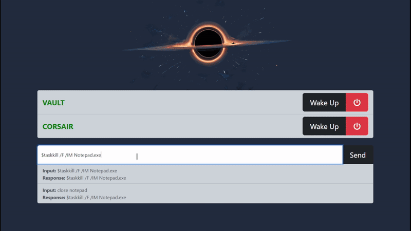

> ### 🚧 Active project: `dashboard_v2/`
> This repo is being rebuilt. The **current work** is the ground-up v2 in
> **[`dashboard_v2/`](./dashboard_v2/)** — start at
> **[`dashboard_v2/docs/HANDOFF.md`](./dashboard_v2/docs/HANDOFF.md)** (the single source for
> current status + next steps). Everything below describes the **legacy Flask app**, which keeps
> running until v2 reaches cutover.

---

# AI Dashboard

Easy control over your services.

Dashboard:

- Monitor server, WOL & shutdown.
- Direct commands (preceded with '$' or '>') or assisted with Koboldcpp/OpenAI backend (default or preceded by 'k:' or 'o:').
- Switch models & start/stop services via assisted command execution. Provide a list of commands, read the sample_prompt.txt for more info.
- Simple prompt & after user input prompt files (command_prompt.txt & command_post_prompt.txt).

## To Do

- Prompt formatting support
- [x] Openai endpoint integration (forced if instruction preceded by 'o:')
- [ ] Simple chatbot (needs history support 4 now)
- Whisper & alltalk integration
- Auto shutdown on idle & wake on connection to local/vpn?
- Discord/Telegram voice bot

## Installation

You will need python 3.11, and also Koboldcpp if you want to use the assistant locally.

Clone the repository and run the install.bat file to install the required packages in a virtual environment.

## Usage

Create or copy the '_sample' files into config.yaml & command_prompt.txt respectively, edit them with your own settings. The configuration file & prompt files will be copied from those '_sample' files provided if they're not present at runtime.

Check the config_sample.yaml file for available settings.

Run the start_wol_server.bat file to start the dashboard. You can connect on <http://127.0.0.1:5432>

Note that Linux users will need to run the start_wol_server.sh file, and it's not up to date, just the wake-on-lan/monitoring functionality is working.

### Dashboard

- You can send commands directly if you precede them with '$' or '>'
- By default, the user request will be sent to the backend of choice (in the config.yaml file) and it will return the crafted command to the textbox, ready to send it after reviewing it.
- You can also use the 'k:' or 'o:' prefix to send the command to the Koboldcpp or OpenAI backend respectively.

- The contents of 'command_prompt.txt' will be sent as system prompt to the AI for the command auto-completion (sample_prompt.txt will be used as default).
- The contents of 'command_post_prompt.txt', if it exists, will be sent after the user input.

### Chat

- You can add a system_prompt.txt file to the chat folder to add a system prompt to the chat.
- You can also add a post_prompt.txt file to the chat folder to add a prompt to the chat after the user input.

### IP Lookup

- Placeholder test, input an IP and returns some info about it.
