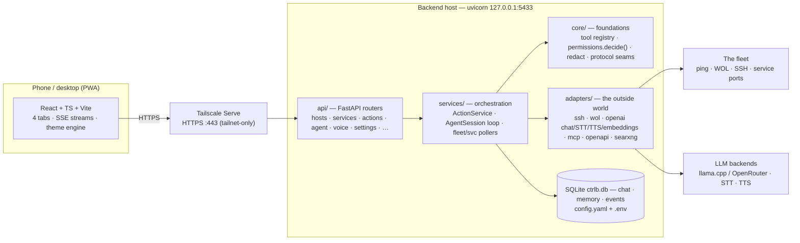

# ctrl-b

**Easy control over your fleet.** A single-user homelab control panel for waking, monitoring, and
managing a personal fleet of PCs over LAN + Tailscale — driven from a phone-first web app or a
tool-using **LLM agent** (text or voice) that executes **typed, allowlisted actions** instead of
raw shell.

<table align="center"><tr><td>
<video src="https://github.com/user-attachments/assets/56b07460-1b58-47ea-aff3-6f06514aae74" controls muted></video>
</td></tr></table>

[](https://github.com/nengoxx/ctrl-b/actions/workflows/ci.yml)
[](./LICENSE)

> **v1.0** — a ground-up rewrite (React + TypeScript + Vite PWA · FastAPI + Uvicorn). The earlier
> hand-built Flask dashboard lives in [`archive/v0.1-flask/`](./archive/v0.1-flask/). *(Internal dev
> docs call this rewrite "v2"/"dashboard_v2" — the development name for what ships as v1.0.)*

---

## Contents

- [What it does](#what-it-does)
- [Architecture](#architecture)
- [Design principles & patterns](#design-principles--patterns)
- [Security model](#security-model)
- [Quickstart](#quickstart)
- [Deploying as a server](#deploying-as-a-server)
- [Configuration](#configuration)
- [Quality harness](#quality-harness)
- [Repository layout](#repository-layout)
- [Documentation map](#documentation-map)

## What it does

Four tabs, one shared chat composer (with push-to-talk mic + auto-TTS), installable as a PWA.
Phone-first (~390 px), widens gracefully to desktop.

| Tab | What lives there |
|---|---|
| **Fleet** | Live host cards (ping/online state, per-host **services** with TCP-probed liveness), wake-on-LAN, shutdown/reboot, service start/stop/restart, expandable detail rows. Risky actions confirm before firing. |
| **Agent** | A tool-calling LLM chat wired to the same action registry the UI uses. Confirm bubbles for gated calls, a live **plan panel** (TodoWrite-style checklist), markdown replies with copy / send-to-composer, per-message local/cloud switching, context **compaction** for long threads. |
| **Utils** | One-shot utility tools (DNS trace, IP info, YouTube captions, …) — the same registry, UI-exposed. |
| **Conf** | The whole `config.yaml` managed from the UI: hosts & services CRUD, inference/voice endpoints, integrations (MCP / OpenAPI / SearXNG / embeddings / open-terminal), skills & agents, per-tool overrides, prompts, memory panel, theme & access (Tailscale HTTPS + QR). |

**The agent** speaks to any OpenAI-compatible backend — local `llama.cpp` or a cloud router — and
sees the action registry as OpenAI `tools`. It also gets: file-discovered **skills** (auto-narrowing
toolsets that make weak local models reliable), **subagents** (bounded parallel delegation),
**web search** (SearXNG), tools from **MCP servers** (Streamable HTTP + stdio) and **OpenAPI/REST
tool servers**, durable **memory** (git-backed markdown, D26), and **voice** via OpenAI-compatible
STT/TTS. Multiple **agent definitions** (model + prompt + tools + privilege) are configurable; one
is default.

**Themes**: a pluggable presentation layer (vapor · minimal kit · cosmos, more to come) — swap the
whole look from Conf, synced across devices.

## Architecture



**Backend layers** (`backend/app/`) — dependencies point downward only; `core/` never imports
`services/` (enforced by a test):

| Layer | Contents | Role |
|---|---|---|
| `api/` | one router per resource | HTTP/SSE surface; thin — no business logic |
| `services/` | `action_service.py`, `agent/` (session loop, subagents, memory, compaction), `fleet.py`, `svc.py`, `actions/`, `tools/` | orchestration: the permission gate, the agent turn loop, concurrent fleet polling with TTL caches |
| `core/` | `tool.py` (registry), `permissions.py`, `redact.py`, `skills.py`, `memory.py`, `agents.py`, `events.py` | dependency floor: the registry, the pure `decide()` gate, secret redaction, pluggable Protocol seams |
| `adapters/` | `ssh.py`, `wol.py`, `inference.py`, `voice.py`, `mcp_client.py`, `openapi_tools.py`, `searxng.py`, `embeddings.py`, `openterminal.py` | every external system behind one construction site each (rewireable live via `runtime.reconfigure`) |
| `domain/` | enums (`Risk`, `Privilege`, `OSType`), host/service/conversation/plan models | shared typed vocabulary |

**One execution path.** Every action — a Fleet button, an agent tool call, a Utils tool, an MCP
tool — flows through the same chain: **registry → `permissions.decide()` → `ActionService` →
adapter**, and every invocation is recorded as an `Event`. There is no second path to side-step.

**The agent loop** (`services/agent/session.py`) streams SSE events (`text.delta`, `part.added`,
`tool.permission`, `compaction`, …) per turn: assemble context (compacting old turns past a token
threshold) → call the model with the aggregated toolset → run ALLOW calls → **suspend** on a
CONFIRM call (persisted `AWAITING_CONFIRM`, rendered as a command bubble; execute/dismiss resumes
the stream — survives restarts and token expiry) → loop until text-only. Skills can narrow the
toolset per turn; subagents delegate scoped tasks depth-capped and privilege-clamped.

**Frontend** (`frontend/src/`): React 19 + TanStack Query for server state, a dep-free
`createStore` for UI state, hand-rolled markdown, and a **theme engine** — semantic design tokens +
a headless-controller **Kit**, with three integration bands per region: *tokens only* → *Surface*
(headless controller + theme-owned view; Fleet today) → *bespoke* (vapor, the reference design).
Themes are lazy `React.lazy` roots switched with View Transitions; appearance state syncs
cross-device through the backend (last-write-wins).

## Design principles & patterns

| Principle | Concretely |
|---|---|
| **Typed actions over raw shell** | Execution = named, allowlisted registry entries with Pydantic inputs, declared `risk` + `confirm`. Raw shell exists but is an off-by-default, gated escape hatch. |
| **Policy as data** | `decide(spec, privilege) → ALLOW / CONFIRM / DENY` is one pure function over declared risk — not `if`s scattered per call site. |
| **One chokepoint per concern** | Config writes: `edit_config_yaml` (comment-preserving, secret round-trip). Output: `redact()` before anything leaves the process. Quality: `tools/check.py`. OS-specifics: a closed, test-pinned allowlist. |
| **Config = human-owned YAML** | `config.yaml` is the source of truth, UI-edited via masked read / unmask-on-write round-trips that never clobber a stored secret or a hand-written comment. `.env` overrides any scalar (`CTRLB_<SECTION>__<KEY>`). |
| **Extend, don't migrate** | Growing dimensions live in one per-item object extended with optional fields (e.g. `tool_overrides: {tool: {description, agent_mode}}`) — never parallel name-keyed sibling maps. |
| **Pluggable via Protocols** | Skills provider/selector, memory provider/backup, agent selector, subagent orchestrator — one consistent seam shape; defaults are file-based and stateless (live-editable). |
| **Decisions are written down** | Locked architectural choices live in [`docs/DECISIONS.md`](./docs/DECISIONS.md) (D1–D34) and load-bearing invariants are pinned by **drift-guard tests** named for them (`test_memory_registry_d27.py`, `test_arch_invariants_qh9.py`, …) so docs can't silently rot. |
| **OS-agnostic by construction** | All target-OS branching keys off `host.os_type` (the managed host), never the server's OS — a Linux server managing a Windows box is the same code path as the reverse. |

## Security model

Full model: [`docs/SECURITY_MODEL.md`](./docs/SECURITY_MODEL.md). The short version:

- **The tailnet is the auth.** Single user, no login. The backend binds `127.0.0.1:5433`; the only
  remote ingress is **Tailscale Serve** HTTPS (never Funnel — nothing public, by construction).
- **Confirm gates, not auth.** Medium/high-risk actions suspend into an explicit confirm step
  (single-use, TTL'd tokens bound to the exact call) — a UX safety, deliberately not a security
  boundary.
- **Secrets never leave.** SSH passwords / API keys live in gitignored `config.yaml`/`.env`, are
  masked on API read, redacted from tool output/logs/SSE, and locked by tests
  (`test_secret_hygiene.py`).
- **Shell is opt-in RCE.** The `!` composer escape hatch and the agent's `run_shell` are two
  independent off-by-default toggles; `run_shell` is denied below FULL privilege even when enabled.

## Quickstart

Config is optional (built-in defaults apply): copy `config.example.yaml` → `config.yaml` and
`.env.example` → `.env` (both gitignored) to set hosts / endpoints / secrets. `ctrlb.db` is created
on first run.

**Windows (double-click):**
```
deploy\windows\setup.cmd     # once: backend venv (Python 3.14) + deps + frontend build
deploy\windows\start.cmd     # PROD on http://127.0.0.1:5433   (-Dev / -Tailscale / -Build)
```

**Linux/macOS (manual, no systemd):**
```bash
deploy/linux/run.sh prod     # build + uvicorn :5433 serving the dist
deploy/linux/run.sh dev      # uvicorn :5433 (--reload) + Vite :5173 HMR
```

**From source, by hand:**
```bash
cd backend && python3 -m venv .venv && .venv/bin/pip install -e ".[dev]"   # Windows: .venv\Scripts\python.exe
# [dev] = the tools/check.py toolchain (ruff/pyright/pytest) — needed to commit; drop it to only run the app
cd ../frontend && npm install
# backend first (Windows: do NOT pass --reload — see note), then frontend:
.venv/bin/uvicorn app.main:app --port 5433        # http://127.0.0.1:5433
npm run dev                                        # http://localhost:5173 (proxies /api → 5433)
```

Requirements: **Python 3.14+** (the code uses 3.14-only syntax) · **Node 20+**. For the mic (and
phone use generally) front the app with HTTPS: `tailscale serve --bg --https=443 5433`.

> **Windows + `--reload` gotcha.** Don't run the backend with `--reload` on Windows — uvicorn's
> reload worker uses an event loop that breaks `asyncio.create_subprocess_exec`, so pings return
> empty and every host shows offline. Linux/macOS are unaffected.

## Deploying as a server

**Linux (systemd, always-on + HTTPS)** — the production shape. One command from a configured
checkout drives the whole deploy over SSH:

```bash
python deploy/bootstrap.py            # prereqs → SFTP config.yaml → prod tree → install.sh → Tailscale HTTPS
python deploy/bootstrap.py --dry-run  # print the plan, change nothing
```

It sets up the **two-instance topology** ([`docs/DECISIONS.md`](./docs/DECISIONS.md) D32, amended
2026-07-09 — trunk-based): PROD = a clean sparse runtime clone at `~/apps/ctrl-b` pinned to a
release **tag**, its own data dir (`~/.ctrl-b`), uvicorn :5433 behind Tailscale Serve :443; DEV =
the workspace (a full checkout on `main` — the only branch) with isolated data (`~/.ctrl-b-dev`,
backend :5434 + Vite :5173). `deploy/linux/install.sh [prod|dev]` is idempotent per instance,
snapshots the prod DB before cutover, and renders the systemd user units. Full runbook:
[`deploy/linux/README.md`](./deploy/linux/README.md).

**Windows (auto-start):** `deploy\windows\autostart-enable.cmd` registers a logon task
(`-Tailscale` re-applies HTTPS at logon too).

**On-box Claude Code agents (tmux):** `install.sh dev` also boots two always-on agent services in the
workspace — `ctrl-b-agent@fable` (Fable 5) and `ctrl-b-agent@opus` (Opus 4.8), each in its own tmux
session. Connect to them:

```bash
ssh emma -t 'tmux attach -t ctrl-b-fable'   # the Fable 5 agent   (Ctrl-b d to detach)
ssh emma -t 'tmux attach -t ctrl-b-opus'    # the Opus 4.8 agent
tmux ls                                     # on the box: list sessions
systemctl --user restart ctrl-b-agent@fable # recreate a session from scratch
```

Both also appear as remote-control sessions at [claude.ai/code](https://claude.ai/code) (same names).
Details (model/effort overrides, one-writer-per-tree, worktrees): [`deploy/linux/README.md`](./deploy/linux/README.md).

## Configuration

Everything lives in one `config.yaml` (see [`config.example.yaml`](./config.example.yaml) — copy
and fill in; every section is optional, built-in defaults apply). Two ways to edit it:

- **The Conf tab** (recommended) — forms for every section, applied **live** (no restart), with
  your hand-written comments preserved and secrets masked on read.
- **By hand** — edit the YAML directly; the backend reads it at startup, so restart after.

Any scalar can also be overridden from `.env` as `CTRLB_<SECTION>__<KEY>=value` — note the
**double** underscore; env always wins over the file. Use it to keep a specific secret out of
`config.yaml` (e.g. `CTRLB_INFERENCE__CLOUD_KEY=sk-...`) — structured values (host lists, server
lists) can't be set this way. Data location: `CTRLB_HOME` (default: the repo root; servers use
`~/.ctrl-b`).

**One risk model everywhere.** Tools and integrations declare a `risk` of `low | med | high`:
`low` runs immediately; `med`/`high` suspend into a confirm bubble (in both the Fleet UI and agent
chat) before executing. Whether a given agent may even reach confirm-gated tools is set by its
`privilege` (`readonly | confirm | auto_low | full`). When a `risk` knob appears below, that's
what it means.

### Adding a computer

Add an entry under `computers:` (or use Conf → the fleet editor). Every field except `ip` is
optional — what you omit simply disables that capability, it never errors:

```yaml
computers:
  vega:
    ip: 192.168.1.20
    mac: "04:7c:16:fe:88:2a"    # omit → no Wake-on-LAN button for this host
    ssh_username: nengo          # omit ssh_* → ping-only host (no shutdown/reboot,
    ssh_password: changeme       #   no service start/stop — status card only)
    ssh_port: 2222               # default 22
    os_type: linux               # linux | windows — the OS of THIS host, not the server's
```

`os_type` is the managed host's OS; it selects which per-OS service command variant runs and the
shutdown/reboot syntax. The server's own OS never matters. `ssh_password` is a secret: masked when
the API reads it back, redacted from logs and tool output.

### Adding a service

Services nest under their host — there is no top-level service list:

```yaml
    services:
      jellyfin:
        kind: jellyfin           # optional free-text type label
        port: 8096               # TCP-probed each poll → the online/offline dot;
                                 #   omit → liveness just follows the host being up
        path: /web               # optional — the row links to http://<ip>:<port><path>
        cmd:                     # per-OS commands; ONLY the host's os_type variant is used
          start:   {linux: "sudo systemctl start jellyfin"}
          stop:    {linux: "sudo systemctl stop jellyfin"}
          restart: {linux: "sudo systemctl restart jellyfin"}
```

Liveness is **derived, never stored** — the port probe is the truth. A service with no `cmd` shows
status + link only (no control buttons); a missing individual command yields a clean "no command
configured" message instead of an error.

### Chat, voice & embeddings endpoints

All model traffic speaks the **OpenAI-compatible** API, so anything that serves it works:

- **`inference`** — two chat backends, `local` (e.g. llama.cpp — needs no `api_key`) and `cloud`
  (e.g. OpenRouter); `default_mode` picks which one new messages use, and the composer prefixes
  `/local` / `//cloud` switch per-message. Keep `request_timeout_s` generous — thinking models
  cold-load slowly.
- **`voice`** — `stt` and `tts` blocks, each with a `primary` + `fallback` endpoint
  (`base_url` / `api_key` / `model`, plus `voice` for TTS). The mic needs a secure context:
  front the app with HTTPS (`tailscale serve --bg --https=443 5433`).
- **`embeddings`** — one `/v1/embeddings` endpoint; powers vector memory / semantic search.

### Connecting MCP servers

List them under `mcp_servers:`; each server's tools are discovered and merged into the agent's
toolset as `mcp__<server>__<tool>`. Both transports are supported:

```yaml
mcp_servers:
  - name: web-tools
    transport: streamable_http   # remote server: url (+ optional headers for auth)
    url: http://192.168.1.160:3003/mcp
    risk: med                    # gates ALL of this server's tools
  - name: filesystem
    transport: stdio             # local subprocess: command + args (+ optional env)
    command: npx
    args: ["-y", "@modelcontextprotocol/server-filesystem", "/data"]
    risk: high
```

Two things worth knowing: `risk` is **per-server, not per-tool** — `med`/`high` means the agent
confirms before *every* call to that server, `low` lets its tools auto-run (only for servers you
trust). And a down server is simply skipped (its tools are absent that run) — it never blocks
startup. Saving from the Conf tab re-discovers tools live.

### OpenAPI / REST tool servers

The HTTP sibling of MCP (`openapi_servers:`), for Open WebUI "tool servers" or any service with an
OpenAPI doc: point `base_url` at the service (the spec is fetched from `/openapi.json`, or set
`spec_url` explicitly) and each operation becomes a tool `api__<server>__<operationId>`. GET/HEAD
operations always auto-run; mutating verbs use the server's `risk` (default `med` → confirm).
`include: [opId, ...]` optionally allowlists operations.

### Other integrations

| Block | What / the gotcha |
|---|---|
| `searxng` | Web search for the agent. The instance **must enable the JSON format** in its `settings.yml` (`search: { formats: [html, json] }`) — stock SearXNG serves HTML only and `web_search` will say so. |
| `open_terminal` | An open-webui/open-terminal server — a Bearer-auth remote shell + file API for the agent. Risk is per-operation: reads auto-run, `exec_risk`/`write_risk` default `high` — it's arbitrary remote shell, keep them gated. |
| `tailscale` | The Conf → Access HTTPS toggle. `serve` only, never Funnel — nothing public, by construction. |
| `agents[]` / `agent` / `tool_overrides` | Alternate agent definitions (model + prompt + tools + privilege), the runtime knobs (compaction, subagent caps, skills dir), and per-tool description/access overrides — commented examples in [`config.example.yaml`](./config.example.yaml) cover these. |

## Quality harness

One command answers "is the repo green?" ([`docs/QUALITY.md`](./docs/QUALITY.md), D33):

```bash
python tools/check.py            # full gate: ruff + pyright + pytest (254) | FE tsc + eslint + prettier + vitest (212)
python tools/check.py --fast     # the pre-commit subset (~2 s)
python tools/check.py --e2e      # + Playwright e2e/a11y (34 tests) — the pre-deploy gate
```

Enforced three ways: native git hooks (`core.hooksPath=.githooks/` — fast pre-commit, full
pre-push; enable once with `git config core.hooksPath .githooks`), **GitHub Actions CI** on
ubuntu-latest, and the opt-in `--e2e` deploy gate (needs `npx playwright install` once).
Invariants are held by drift-guard tests, not discipline — see the audits in
[`docs/`](./docs/) (`SYSTEM_AUDIT`, `UI_AUDIT`, `AGENT_CHAT_AUDIT`, `QH_AUDIT`).

## Repository layout

```
backend/     FastAPI + Uvicorn service — app/{api,services,core,adapters,domain}, tests/ (254)
frontend/    React + TS + Vite PWA — src/{tabs,store,hooks,theme-engine,themes}, tests/ (212), e2e/ (34)
docs/        architecture · decisions · design · audits · runbooks — START at docs/HANDOFF.md
deploy/      bootstrap.py + linux/ (systemd kit) + windows/ (double-click scripts)
tools/       check.py (the quality gate) + dev launchers
agents/      bundled agent definitions        skills/   bundled agent skills
design/      the Vapor visual spec + prototypes (reference only)
archive/     v0.1 Flask app, dead inference helpers, early UI prototypes
```

## Documentation map

| Read | For |
|---|---|
| [`docs/HANDOFF.md`](./docs/HANDOFF.md) | Living status + next steps — **start here** |
| [`docs/DESIGN.md`](./docs/DESIGN.md) · [`docs/SPEC.md`](./docs/SPEC.md) · [`docs/ARCHITECTURE.md`](./docs/ARCHITECTURE.md) | Concrete code design (data structures, agent loop, SSE wire protocol, extension cookbook) · verified as-built spec (C4 diagrams, inventories) · deployment profiles + OS invariants |
| [`docs/DECISIONS.md`](./docs/DECISIONS.md) | Every locked architectural decision (D1–D34) with rationale |
| [`docs/SECURITY_MODEL.md`](./docs/SECURITY_MODEL.md) | The trust boundary, gates, secret handling, safe-defaults checklist |
| [`docs/THEME_ENGINE.md`](./docs/THEME_ENGINE.md) | The pluggable theme layer (tokens · Kit · Surfaces) |
| [`docs/QUALITY.md`](./docs/QUALITY.md) · [`docs/QH_AUDIT.md`](./docs/QH_AUDIT.md) | The quality harness + its audit |
| [`docs/DEPLOY_EMMA.md`](./docs/DEPLOY_EMMA.md) · [`deploy/linux/README.md`](./deploy/linux/README.md) | Server deploy topology + runbook |
| [`AGENTS.md`](./AGENTS.md) | The canonical contributor/agent guide (rules, commands, security) |

**Contributing / agents:** read [`AGENTS.md`](./AGENTS.md) first. License: [GPL-3.0](./LICENSE).
