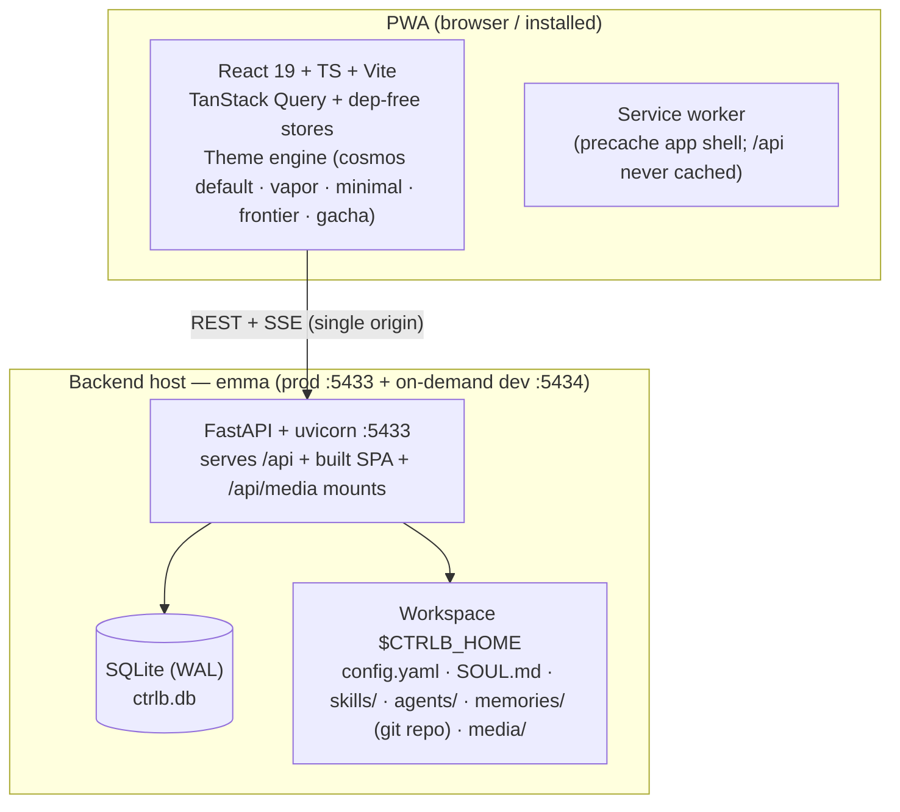
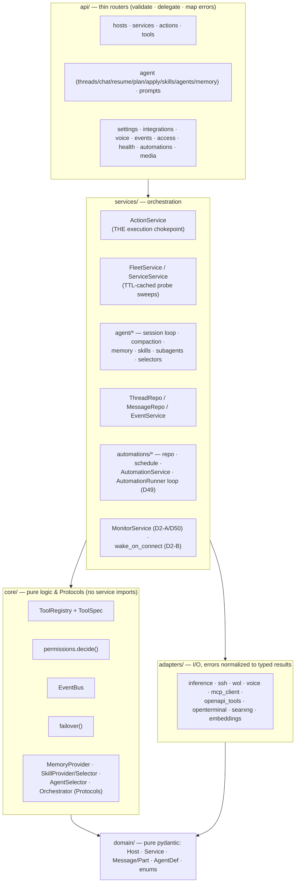
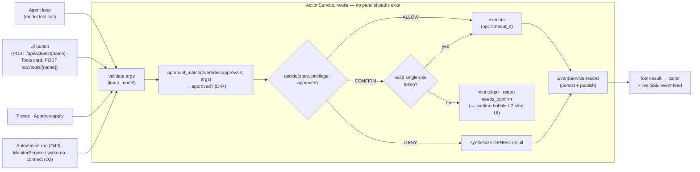
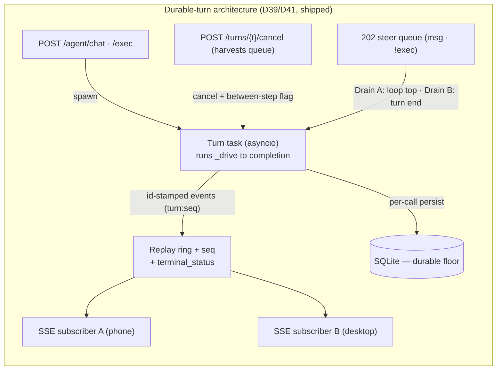
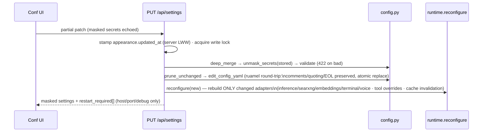
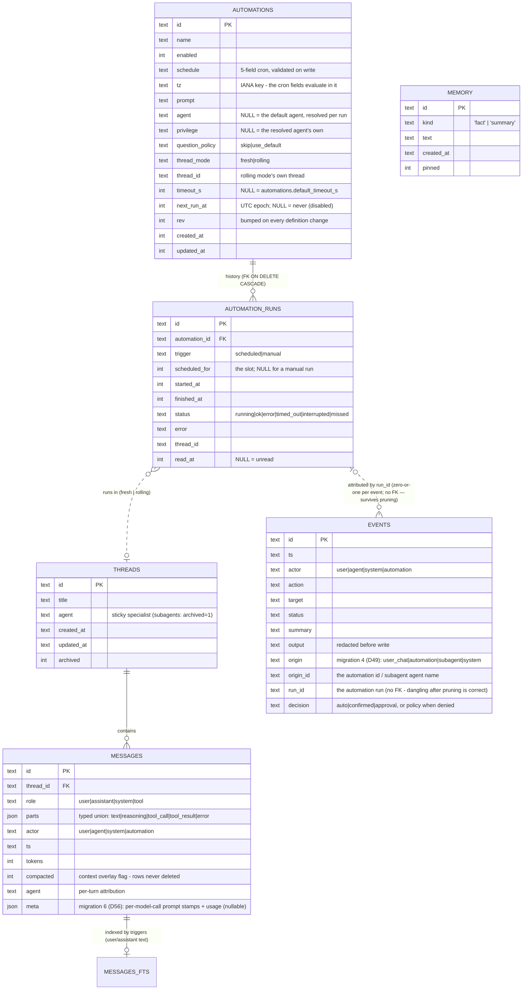
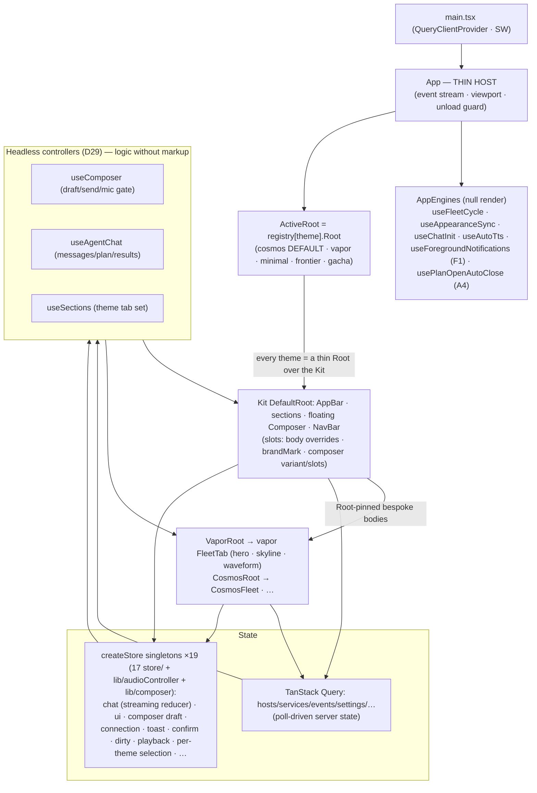

# ctrl-b — System Specification (visual)

> **What this is.** The visual, one-stop specification of ctrl-b's **functionalities, architecture,
> and design patterns** — the whole system and every subsystem — at C4-style altitude with
> diagrams, flows, state machines, and inventories. It complements (never replaces) the prose
> canon: [`ARCHITECTURE.md`](./ARCHITECTURE.md) (system design rationale), [`DESIGN.md`](./DESIGN.md)
> (code-level contracts), [`DECISIONS.md`](./DECISIONS.md) (locked choices), [`SECURITY_MODEL.md`](./SECURITY_MODEL.md),
> [`THEME_ENGINE.md`](./THEME_ENGINE.md), and the audits ([`AGENT_CHAT_AUDIT.md`](./AGENT_CHAT_AUDIT.md) ·
> [`SYSTEM_AUDIT.md`](./SYSTEM_AUDIT.md) · [`UI_AUDIT.md`](./UI_AUDIT.md)). On conflict, DECISIONS wins.
>
> **Status legend** — ✅ built & verified · ▹ planned target state · ◇ named seam (designed
> extension point, build-on-demand). *(The ACA plan = `TODO.md` Phase 12, approved 2026-07-07:
> **Slices 0–8 are all shipped** — D38–D44 cover slices 2–8, so the ▹ marks they carried are now
> ✅.)* Pillar ids are **P#** — **F#** is reserved for `UI_AUDIT.md` finding ids.
>
> *Source of truth for this document: direct code audit of the full stack (see the two audit docs'
> method sections). Drawn 2026-07-07.*

---

## 1. Product vision & functionality inventory

**ctrl-b is a single-user, self-hosted homelab control panel**: a mobile-first PWA through which
the owner wakes, monitors, and manages a small fleet of PCs and services over LAN + Tailscale —
by touch, by chat with a tool-using LLM agent, or by voice. It is **tailnet-only by construction**
(no public exposure), runs a **weak local model first** with cloud failover, and treats every
privileged operation as a **typed, gated, audited action**. The aesthetic contract is the Vapor
design (D7) with a multi-theme engine on top (D28/D29/D31).

| # | Pillar | Capabilities | Status |
|---|--------|-------------|--------|
| P1 | **Fleet control** | Wake-on-LAN, ICMP liveness + latency, SSH shutdown/reboot, per-host service start/stop/restart, TCP service probes, open-service-URL, host/service CRUD from the UI | ✅ |
| P2 | **Agent chat** | Streaming tool-loop chat (SSE), the full action registry as OpenAI tools, confirm-gated risky calls with suspend/resume, task plans (TodoWrite-style + clickable panel), clarifying questions, context compaction w/ selectable summarizer, per-message local/cloud switch, markdown replies | ✅ |
| P3 | **Agent platform** | File-discovered **skills** (SKILL.md; user- & selector-invoked, toolset narrowing), folder-discovered **agents** (agent.yaml + SOUL.md persona; `/agent` switch + optional auto-routing), headless **subagents** (bounded parallel, privilege-clamped), **memory** — tier 1 (MEMORY/USER/STATE stores, cap headers, propose-or-auto-write, git-versioned) + the opt-in tier-2 **Core Memory** corpus (shared markdown index + on-demand topic reads via `core_memory`, D57), **session search** (FTS5), loop-discipline guards, self-managed skills (`skill_manage`) | ✅ |
| P4 | **Integrations** | MCP client (streamable-HTTP + stdio), generic OpenAPI tool servers, open-terminal remote shell/files, SearXNG `web_search`, embeddings client (seam), per-tool overrides (description + tri-state agent access), between-turn rediscovery | ✅ |
| P5 | **Voice** | Push-to-talk dictation (STT proxy, 5-state mic), read-aloud TTS (per-bubble + auto-TTS, docked mini-player, blob cache), primary→fallback failover per service, capability-probed UI | ✅ |
| P6 | **Config & ops** | Whole config editable in-app (masked secrets, comment-preserving writes, hot-apply), Tailscale Serve HTTPS toggle, live events feed + audit trail, guarded `!` shell escape hatch (opt-in), PWA install/update | ✅ |
| P7 | **Theming** | Registry-driven multi-theme engine — **five built themes** (cosmos = `DEFAULT_THEME` · vapor · minimal · frontier · gacha), token-driven Kit scaffold, View-Transition switching, per-theme settings, cross-device appearance sync (LWW) | ✅ |
| P8 | **Durable turns** | Server-owned turn lifecycle: disconnect-proof generation, reconnect replay/snapshot, explicit cancel + Stop button, mid-turn steering queue | ✅ ACA Slices 3/5 (D39/D41) |
| P9 | **Perf & routing** | Parallel read-only tool execution + per-call result streaming (Slice 4 ✅, D40); compaction v2 — window-aware trigger, tool-result clearing, template, thrash breaker, ModelRef call config/A10 (Slice 6 ✅, D42); failure-fallback model routing + retry classifier + typed retry/failover events (Slice 7 ✅, D43); persisted approvals — per-tool "always allow" rules that downgrade a risk-derived confirm (Slice 8 ✅, D44) | Slices 4/6/7/8 ✅ |
| P10 | **Unattended & awareness** | Scheduled **automations** (cron defs in SQLite, runner + attributed headless runs, `create_automation`/`list_automations`, Conf → Automations, D49), foreground **notifications** (prefs in config, one client-side gate), **fleet monitor** loop (confirmed up/down transitions → Events, D2-A/D50), **wake-on-connect** (the SPA opening the event stream wakes flagged hosts, D2-B) | ✅ |
| P11 | **Future** | Wake word, idle shutdown, vector memory, privilege ladder UI, Web Push | ◇ ROADMAP seams |

---

## 2. System context (C4 L1)


**Boundary rules (SECURITY_MODEL):** the backend never binds publicly; Serve is the only HTTPS
ingress; no auth *inside* the tailnet (single-user trust model); secrets live only in gitignored
`config.yaml`/`.env`, masked on read, redacted from free text; the raw-shell paths are **off by
default** and double-gated. Rider (SYS-4): the *dev* Vite proxy widens this on the LAN — the ruled
half is the Serve default, flipped `5173` → **`5433`** (`DECISIONS.md` D20 §3, QH-11 amendment
2026-07-07); the dev-proxy exposure itself is still only documented there, not fenced.

## 3. Containers & deploy topology (C4 L2, D32)



| Container | Tech | Responsibility | Talks to |
|---|---|---|---|
| PWA | React 19, TS strict, Vite, vite-plugin-pwa | All presentation; offline shell; voice capture/playback | `/api` REST + 2 SSE feeds |
| API server | FastAPI, uvicorn, sse-starlette | Everything else: registry, gate, agent loop, proxies, config | fleet, LLMs, voice, MCP/OpenAPI, SearXNG |
| SQLite | aiosqlite, WAL, numbered migrations | threads/messages (parts-JSON), attributed events audit, FTS5 index, automation defs + run history | — |
| Workspace | plain files + a local git repo | config, personas, skills, agents, memory (auto-committed), owner media | — |

**Deploy (D32, AMENDED-2):** emma hosts **both** instances as systemd *user* units — prod `:5433` @
`~/apps/ctrl-b`, `CTRLB_HOME=~/.ctrl-b`, boot-started, Serve → HTTPS `emma.….ts.net`; and an
isolated **on-demand** dev instance `:5434` + Vite `:5173` + `~/.ctrl-b-dev`, started/stopped around
iteration in the workspace checkout. emma is also where sessions run; the **corsair checkout is a
frozen plain clone** (reference only — corsair stays a *managed fleet host*), which is why the
Windows `--reload` subprocess event-loop gotcha is a documented constraint rather than a daily one.
Bootstrap via `deploy/bootstrap.py`; runbook `DEPLOY_EMMA.md`.

## 4. Backend architecture (C4 L3)

### 4.1 Layering (ports & adapters)



Composition root = `main.py::lifespan` (builds in dependency order onto `app.state`);
`runtime.py` = the **anti-drift reconstruction seam** (every adapter has exactly one `set_*`
construction site shared by startup and hot-reload).

### 4.2 The execution chokepoint — every capability, one path



**The gate truth table** (`core/permissions.decide` — pure, unit-tested; source of truth = the code +
`DESIGN.md` §3, this is the visual view):

| Privilege ↓ / Tool → | LOW risk | MED risk | HIGH risk or `confirm=True` | `run_shell`* |
|---|---|---|---|---|
| `readonly` | ALLOW (**incl. LOW-risk actions** — `ping_host`, `wake_host`) | DENY actions† / CONFIRM non-action | DENY actions† / CONFIRM non-action | DENY |
| `confirm` (default) | ALLOW | CONFIRM | CONFIRM | DENY* |
| `auto_low` | ALLOW | ALLOW | CONFIRM | DENY* |
| `full` | ALLOW | ALLOW | ALLOW | ALLOW |

\* unless `shell.agent_exec_enabled` opts the agent in (both shell gates default **off**).
† the readonly clamp is narrow by construction: `category == "action" AND risk != LOW` → DENY. It is
*not* a blanket "no actions" — a LOW-risk action stays ALLOW at `readonly`.
✅ **Persisted approvals (Slice 8, D44):** `tool_overrides{<tool>: {approvals: [ApprovalRule]}}` are
consulted before `decide`; a matched rule (OR across rules, AND within one, `fnmatchcase` on
canonicalised scalar args; `args: null` = whole-action, `args: {}` = the empty AND) passes
`approved=True`, which downgrades a **risk-derived** CONFIRM (MED or HIGH) to ALLOW. Precedence is
unchanged above it: the `run_shell` and `readonly` DENYs win outright, and a designer-forced
`spec.confirm=True` is un-downgradable below `full` (the approval is ignored) — so approvals are
consulted only when the tool's confirm is risk-derived.

### 4.3 The tool registry — one capability model

| Provider | Registers | Naming | Risk source |
|---|---|---|---|
| Built-in actions (`@action`) | wake/ping/shutdown/reboot/start/stop/restart/check_service/open_service_url/run_shell/tailscale_* | plain | decorator |
| Cognitive builtins (`core=True`, always reachable) | `task_plan` · `question` · `memory` · `session_search` | plain | decorator |
| Agent builtins (`category="builtin"`, `core` **default False** — an allowlist may exclude them) | `skill_manage` (LOW) · `spawn_subagents` (MED) · `create_automation` (MED, `confirm=True`, refused in any non-interactive context) · `list_automations` (LOW, `read_only`) | plain | decorator |
| Core Memory (D57, `core=False` — an allowlist may exclude it) | `core_memory` (`read`/`search`/`create`/`update`/`remove`/`delete` over the tier-2 corpus; hidden from the schema while `memory.longterm.backend` is null) | plain | decorator |
| Utilities (`@tool`, Tools-tab cards) | `dns_trace` · `ip_info` · `yt_captions` (`services/tools/`) | plain | decorator |
| `web_search` | an `@action` with `category="utility"`, `read_only=True`, `ui_exposed=False` — agent-only, not a Tools card | plain | decorator |
| open-terminal | `terminal_exec` · `terminal_read_file` · `terminal_write_file` · `terminal_list` · `terminal_grep` · `terminal_glob` | plain | **config per-op** (reads LOW, exec/write HIGH) |
| MCP servers | discovered per server | `mcp__<server>__<tool>` | annotations (readOnly→LOW, destructive→HIGH) else server config |
| OpenAPI servers | one per operation | `api__<server>__<opId>` | GET/HEAD→LOW; mutating→server config |

Per-tool **overrides** (`tool_overrides{name: {description, agent_mode, approvals}}`, D22 + D44) overlay the live
specs; agent allowlists (`AgentDef.tools`, glob) + skill narrowing intersect it; `core` builtins
survive both. A **disabled feature's** tools are dropped *after* that union (`for_agent(hidden=…)`,
D57 — applied identically at the schema set and the availability guard), and `ToolSpec.describe`
lets a spec render its description from live settings (the tier-aware `memory` wording). Registry
rebuilds only **between** turns (▹ ACA-17 closes the auto-path race).

### 4.4 Design-pattern catalog (named, verified in code)

| Pattern | Where | Note |
|---|---|---|
| Ports & adapters (hexagonal) | whole backend | import-disciplined; Protocols at the seams |
| Composition root + anti-drift construction seam | `main.py` + `runtime.py` | one construction site per adapter |
| Registry | tools · themes · memory stores · proposables | "adding one = one row, never a switch statement" |
| Chokepoint (single writer/path) | ActionService · `edit_config_yaml` · EventService | uniqueness verified by audit |
| Strategy via Protocol (swappable defaults) | Skill/Agent selectors, MemoryProvider/Backup, Orchestrator | D11 |
| Derived state doctrine | fleet/service status, tailscale state, skills/agents/memory | *config declares, probes derive, nothing recomputable stored* |
| Single-flight TTL cache | Fleet/Service sweeps | N clients share one probe |
| Failover primitive (value-agnostic) | `core/failover` async generator → inference (first-chunk probe + retry tier), voice | live typed retry/failover events (D43); degradation surfaced, never silent |
| Structured concurrency | subagents (`asyncio.TaskGroup` + semaphores + clamps) | cancel-parent-cancels-tree |
| Unified per-item config object | `ToolOverride`, host `services{}`, `appearance` blob | owner directive: shape to extend, not migrate |
| Prompt-cache stability layering | agent session static head + tools cache | Codex/Claude-Code doctrine, independently converged |
| Progressive disclosure | skills (instructions only when active), memory caps | context economy for the weak local model |
| External-store binding (dep-free) | `createStore` (D23) — **19 modules** (17 in `src/store/` + `lib/audioController.ts` + `lib/composer.ts`) | documented snapshot contract |
| Thin host + headless controllers | `App` → ActiveRoot; `useComposer`/`useAgentChat` (D29) | logic themes share, markup themes own |
| Command palette / prefix routing | composer `!` · `/verb` · text | one grammar, all themes |

## 5. Key flows

### 5.1 Agent chat turn — stream · tool loop · confirm suspend/resume ✅ (durable turns + steering shipped, D39/D41)

```mermaid
sequenceDiagram
    autonumber
    participant U as PWA (store/chat)
    participant A as api/agent
    participant S as AgentSession
    participant I as InferenceClient
    participant X as ActionService

    U->>A: POST /agent/chat {text, thread_id?, mode?, skills?, privilege?}
    A->>A: thread ?: create · rediscover-if-dirty · resolve AgentDef (+auto-route◇)
    A-->>U: SSE: thread {threadId,title}
    A->>S: run_turn()
    S->>S: activate skills · persist user msg · arm reflection?
    loop ≤ max_iterations
        S->>S: clear tool outputs + compact if est > window×frac−reserve (D42: anchored · notice · breaker · backstop)
        S->>I: stream_chat(static head + history, tools)
        Note over I: failover at first chunk only; transient retry-in-place first (D43);<br/>each retry/hop → live inference.retry / inference.failover event
        I-->>U: reasoning.delta* · text.delta* (relayed per token)
        alt no tool calls
            S-->>U: message.end · done(completed)
        else tool calls
            S-->>U: part.added (per call) · message.end
            loop calls: read-only prefix in parallel (D40), serial tail; results streamed per call
                S->>X: invoke(tool, args, privilege)
                alt CONFIRM needed (serial tail only)
                    X-->>S: needs_confirm + token
                    S-->>U: tool.permission {callId, token, risk} · done(suspended)
                    Note over U,S: turn ends; state durable (AWAITING_CONFIRM)
                else executed / denied
                    X-->>S: ToolResult (Event recorded)
                    S-->>U: tool.result (per call — persist-before-emit)
                end
            end
            Note over S: loop guards: repeat cap · per-tool cap ·<br/>stall detector → forced tool-less finalize
        end
    end
    U->>A: POST /agent/resume {call_id, execute|dismiss|answer}
    A->>S: resume() — re-mint token (J3) · single-flight (J2) → finish step → loop continues
```

**Shipped (D39, Slice 3)** — this generator is re-homed into a server-owned **TurnRegistry** task
with a monotonic-`seq` replay ring: disconnect detaches a subscriber instead of cancelling the turn;
`GET /agent/turns/{thread}/stream` re-attaches (tail-replay or snapshot); `POST …/cancel` is the
explicit, idempotent stop. **Shipped (D41, Slice 5)** — sending during a live chat/resume turn
returns **202** and enqueues a steer (a message *or* an `!exec`); the queue drains at the `_drive`
loop top (**Drain A**) or, on a `completed` turn end, spawns the next turn (**Drain B**); a `Stop`
**harvests** the queue back to the composer.



### 5.2 Tool-call lifecycle (RunState) ✅

```mermaid
stateDiagram-v2
    [*] --> pending: model emits call
    pending --> ok: ALLOW → executed
    pending --> denied: policy / headless confirm / unknown tool
    pending --> error: adapter failure (normalized)
    pending --> timeout: spec timeout_s
    pending --> awaiting_confirm: CONFIRM (interactive)
    pending --> awaiting_answer: question tool
    awaiting_confirm --> ok: resume(execute) — re-minted token
    awaiting_confirm --> denied: resume(dismiss) — owner rejected, no-retry steering
    awaiting_answer --> ok: resume(answer) — reply injected as result
    awaiting_answer --> denied: resume(dismiss) — owner declined to answer
    note right of awaiting_confirm: durable in SQLite —\nsurvives reload/restart;\nabandoned → synthesized\n"skipped" in next context
```



D39 (shipped) adds `cancelled` (in-flight calls marked on Stop + synthesized like abandoned confirms).

### 5.3 Settings hot-apply ✅



### 5.4 Voice ✅

```mermaid
sequenceDiagram
    participant M as Mic (useDictation)
    participant V as /api/voice/stt
    participant W as Whisper primary→fallback
    M->>M: tap → getUserMedia → MediaRecorder\n(mime negotiated; ext follows actual container)
    M->>V: POST clip (multipart)
    V->>W: transcriptions.create (+vad/hotwords via extra_body)
    Note over V,W: any error → next endpoint (failover);\nX-Voice-Served-By surfaces degradation
    V-->>M: {text} → appendDraft (review) · or auto-send when idle
```

Mic state machine: `idle ↔ recording → sending → idle`, plus reactive `unavailable` (502, re-arms
on next status probe) and `insecure` (no secure context — tappable, explains the HTTPS fix).
TTS: per-bubble ▶/⏸ + auto-TTS on turn completion → `/api/voice/tts` (whole-clip, seekable) →
singleton `<audio>` + blob cache + docked MiniPlayer.

### 5.5 Theme switch ✅

`switchTheme(next)`: **preload first** (CSS + fonts + lazy Root chunk, cached promises) → then
`startViewTransition(() => flushSync(setUI(...)))` — gated on `ui.motion` and feature support;
load failure aborts and stays on the current theme. `preloadableRoot` renders synchronously once
loaded, so the transition snapshot never captures a Suspense fallback.

## 6. Data & persistence

### 6.1 SQLite (WAL · numbered migrations · single write lock)



Doctrine: **message-has-parts** (schema grows via the JSON union, not migrations); **compaction is
an overlay** (`compacted` flag + summary system-message; full history immutable); events =
domain-level audit trail — since migration 4 (D49) every row is **attributed** (`origin`/`origin_id`/
`run_id`/`decision`), which is what makes an unattended automation run auditable. The `memory` table
is created by migration 1 but **has no reader/writer**: tier-1 and tier-2 memory are markdown in the
workspace git repo (§6.2), so it stays the reserved slot for a future vector store.
✅ SYS-1 closed: `Database.transaction()` (`db.py`) wraps multi-statement sequences in one
`BEGIN IMMEDIATE` under the write lock — inner `execute()` calls join it via a contextvar.

### 6.2 The workspace (`$CTRLB_HOME`, relocatable — D14/D15)

```
$CTRLB_HOME/
├── config.yaml            # THE config (gitignored; UI-managed; comment-preserving writes)
├── ctrlb.db               # SQLite (chat · events · FTS)
├── SOUL.md                # default agent persona (slot #1 of the prompt)
├── skills/<name>/SKILL.md # global skills (frontmatter + instructions)
├── agents/<slug>/         # specialists: agent.yaml (overrides) + SOUL.md + skills/
├── media/<ns>/<role>/     # owner art per NAMESPACE + role (D53; `core/media.py` validates the shape,
│                          #   served read-only at /api/media/<ns>/files — a stray folder stays invisible)
└── memories/              # ← local git repo (D26, auto-commit + external-edit sweep)
    ├── MEMORY.md USER.md STATE.md      # tier 1: default agent + global stores (capped, § entries)
    ├── agents/<slug>/MEMORY.md STATE.md
    └── core/                           # tier 2 (D57, opt-in): MEMORY.md routing index + topic files
```

### 6.3 Config surface (`config.yaml` sections)

| Section | Governs | Hot-apply |
|---|---|---|
| `server` | bind/port/poll cadence/debug | poll live; host/port/debug → restart-flagged |
| `computers{}` (+nested `services{}`) | the fleet: ip/mac/ssh/os/services cmd-per-OS | live (projected per call) |
| `inference` | the chat chain: `provider` primary + ordered `fallbacks[]` (each a `{provider, model?}` ref, D48), prompts, failover, transient chat-stream retry budget (`retry_attempts` global + per-provider override, D43) | rebuild-on-change (retries hot at next turn) |
| `providers{}` | the endpoint catalog every section refs by name (D48/A11): `base_url`/`api_key`/`api_mode`/`models{}`, the per-**server** request gate (`max_concurrent_requests`, D40 as amended by D48 §C4 — keyed by canonical base_url, shared by chat+voice+embeddings), per-model `context_window` + `max_tokens_field` (D42) | rebuild-on-change (window auto-probed from llama.cpp `/props`) |
| `agent` | defaults (AgentDef base incl. `max_parallel_tools`, D40, + failure-fallback `routing` — `lead`/`failure_threshold`/`fallback_turns`, the global `agent.defaults.routing`, D43), compaction v2 (`threshold_frac`/`keep_recent_tokens`/`clear_output_min_tokens`/`clear_keep_steps`/`max_consecutive_failures`/`reserve_output` + `threshold_tokens` no-window fallback, D42), ModelRef call config (`max_tokens`/`reasoning_effort`/`reasoning_tokens`, D42/A10), skills, subagent caps, streaming mode, auto-route, durable-turn + steer-queue knobs (`turns.*` incl. `steer_queue_max`, D41) | live (compaction/window/routing edits apply at the next turn — D42 Inv-11) |
| `memory` | tier-1 stores, caps, auto-write, nudges, reflection, git backup **+ the tier-2 slot `longterm{backend, core{root, index_char_limit, topic_char_limit, recall_char_limit, consolidation_nudge_pct}}`** (D57 — `backend` is the only switch, null = off) | live |
| `prompts{}` | per-prompt overrides keyed by the registry id (Phase 18/D56; **23 ids** — D57 adds `core_memory_policy`, `core_memory_recall`, `consolidation`, `consolidation_promote`, `memory_cap_error`) | live |
| `voice` / `searxng` / `embeddings` / `open_terminal` | endpoints + per-op risk | rebuild-on-change |
| `shell` / `tailscale` | the two guarded escape hatches | live |
| `mcp_servers[]` / `openapi_servers[]` | remote toolsets | between-turn rediscovery |
| `tool_overrides{}` | per-tool description + agent access (D22) **+ `approvals[]` — the persisted "always allow" rules (D44), served back on `GET /api/actions` so the catalog renders + revokes them** | live overlay |
| `notifications` | foreground-notification prefs: `{enabled, events{agent_input, turn_done, action_failed, automation_done}}` (F1) — read by the client through the thin `GET /api/notifications`; the backend never sends a notification itself | live |
| `wake` | fleet wake automation: the D2-B connect cooldown + the D2-A presence tunables (`presence_device_ips`, per-host `wake_on_presence`) | live |
| `monitor` | the `MonitorService` tick interval + the asymmetric up/down damping thresholds (D2-A/D50) | live (re-read per tick — the master switch is live) |
| `automations` | the `AutomationRunner` tunables only (`default_timeout_s`, …) — the **definitions live in SQLite**, not in YAML (D49) | live (re-read per tick) |
| `media{}` | owner media state keyed by **namespace** (mirrors `MEDIA_NAMESPACES`, incl. `kit`, which no theme owns — D52/G5 + D53); absent key = every consumer stays on its bundled art | live |
| `appearance` | theme/mode/accent/motion/perf + per-theme settings (server-stamped LWW) | live |

Secrets: two-rule model (declared leaf keys + hinted credential-map subkeys) → masked on GET,
carried-over on PUT, redacted from search snippets, drift-guard-tested.

## 7. Frontend architecture



**Render discipline (verified):** token deltas re-render only the streaming bubble (per-message
memo + sliced subscriptions + ref-stable lookups); engines isolated from the theme tree; plan
snapshot content-signature-stable. **Theme contract:** a theme = one `ThemeDef` registry row
(Root, palettes, lazy loadStyles/Fonts/Root, optional per-theme settings auto-rendered in Conf);
a theme = tokens.css over the Kit, plus whatever bodies it pins. **vapor is no longer a frozen
bespoke shell** — D51 V4 pivoted `VaporRoot` onto `DefaultRoot` (which now owns the dvh column,
scroller, section bodies, measurements and overlays); what stays vapor is the Root-pinned Fleet body
(hero · skyline · waveform), the `brandMark` slot, `body[data-skyline]`, and its declared kit axes.
Bespoke *bodies* are bespoke-by-right (D31 §1.1); vapor is also the one **eager**-CSS theme.
**Wire safety:** every SSE frame validated → drop-not-crash; unknown
events ignored (forward-compatible).

## 8. Wire protocols

### 8.1 Chat SSE vocabulary (DESIGN §12 subset — ✅ built · ▹ additions)

| Event | Payload | Note |
|---|---|---|
| `thread` | threadId, title | head of every turn |
| `message.start` / `message.end` | messageId, agent | per assistant step |
| `reasoning.delta` / `text.delta` | messageId, delta | per token |
| `part.added` | tool_call part | renders command bubble |
| `tool.permission` | callId, tool, args, risk, **token**, prompt | confirm bubble; suspends |
| `tool.question` | callId, question | answer bubble; suspends |
| `tool.result` | callId, ToolResult | per-call, persist-before-emit; completion order under the parallel prefix (D40) |
| `steer.applied` | entryId, messageId, kind, text? | mid-turn steer drained at the loop top (D41); text = message kind only |
| `compaction` | removed, summaryId, truncated | breadcrumb |
| `notice` | text | "// compacting…" (ACA-11) · routing notes (D43) |
| `inference.retry` | endpoint, attempt, max, delaySeconds, category | transient same-endpoint retry, live (D43/A6); a mid-backoff re-attach renders it from the snapshot's `retry_status` |
| `inference.failover` | from, to, category | chain dropped to next endpoint, live (D43/A6; supersedes the D18 degraded notice) |
| `error` | message, retryable | normalized; feeds risk-aware retry (I4) |
| `done` | state: completed·suspended·capped·error | terminal (+`cancelled` on Stop, D39) |
| `turn.sync` | the accumulator snapshot + `steer_queue` (+ `retry_status`) | **re-attach only** (D39): when a tail-replay can't cover the gap, `GET …/stream` opens with ONE snapshot frame instead of replayed events; the client applies it through `applyTurnSync` (force-overlay), then live frames dedupe strictly beyond its `seq` |
| `id:` field | `<turnId>:<seq>` | replay cursor (D39, shipped) |

Dual-mode delivery (D17): same generator collected into one JSON payload when
`agent.streaming=off`/client asks buffered. Second feed: `GET /api/events/stream` (fleet
activity, EventBus, 15 s keepalive) with client auto-reconnect + reconcile.

### 8.2 REST surface (by router)

Every router is mounted under **`/api`** (`main.py::include_router`); the paths below are
router-relative.

| Router | Endpoints (abridged) |
|---|---|
| hosts / services | list + status + CRUD (comment-preserving YAML edits) + wake/shutdown/reboot/start/stop/restart via actions · `GET /hosts/vpn-discovery` (D3: propose a `vpn_host` per host from `tailscale status --json` — read-only, never writes config; 403 when Tailscale control is off) |
| actions / tools | catalog (specs + schemas + retry_safe + each tool's `approvals`) · `POST /actions/{name}` (the name is in the **path**; UI two-step confirm — re-POST with `confirm_token`) · Tools-tab twin `POST /tools/{name}` (utility cards only, 404 otherwise; no confirm dance) |
| agent | threads CRUD · `chat` · `resume` · `compact` (D42: `instructions?` in → `{removed, summaryId?, truncated?, rejected?}` out) · `plan` · `apply` · `exec` (!) · skills CRUD · agents CRUD (+SOUL, memory stores) · `GET /memory/core/status` (tier-2 corpus status — derived, read-only, D57) · default-prompt (`chat`/`exec` → **202 steer-enqueue** when the thread runs a chat/resume turn, D41) · `GET /providers` (A11/D48: the composer + Conf provider directory — a NAKED non-secret read; names + catalogs + the effective chain + `verbs`) |
| settings | `GET/PUT /settings` (masked/hot-apply) · `GET /appearance` · `GET /notifications` (the F1 prefs projection — an always-on read for the app-global engine; writes still ride `PUT /settings`) |
| prompts | `GET /prompts` (Phase 18: every registry id + label + effective template + placeholders — read-only; edits ride `PUT /settings` `prompts:`) |
| integrations | MCP/OpenAPI CRUD · `rediscover` (409 while turn active) · status |
| voice | `status` · `stt` · `tts` |
| events / access / health | audit list + SSE · Tailscale Serve control · health |
| automations (D49) | `GET /automations` · `POST /automations` (201) · `POST /automations/schedule-preview` (validate a cron + show the next fires) · `PUT /automations/{id}` · `POST /automations/{id}/enabled` · `DELETE /automations/{id}` (204) · `POST /automations/{id}/run-now` (202) · `GET /automations/{id}/runs` · `POST /automations/runs/{run_id}/read` |
| media (D53) | `GET /media/{ns}` (the namespace index — roles + what the owner has installed) + a per-namespace **static mount** at `/media/{ns}/files` (`MediaFiles`, restricted to the roles the index advertises, so a folder parked beside them is invisible rather than quietly public) |
| agent turns (D39/D41) | `GET /agent/turns/{t}` (status + `steer_queue`) · `GET …/stream` (re-attach) · `POST …/cancel` (idempotent Stop; harvests `steer_queue`) · `DELETE …/steer/{entry_id}` (unsend a queued steer) |

## 9. Repository structure

```
ctrl-b/
├── backend/
│   ├── app/ {api, services(/actions, /agent, /tools, /automations, monitor.py, wake_on_connect.py), core, adapters, domain, config.py, db.py, main.py, runtime.py}
│   ├── tests/               # 111 files + conftest, decision-pinned (test_*_d26 …) + drift guards
│   └── pyproject.toml       # exact pins · ruff (py314) · pyright[nodejs]
├── frontend/
│   ├── src/ {api, components, hooks, lib, store, tabs, theme(-engine)/{kit,…}, themes/{cosmos,vapor,minimal,frontier,gacha}}
│   ├── tests/ (vitest+jsdom)  e2e/ (Playwright: flows·a11y·render·contrast·kit-render)
│   └── vite.config.ts       # PWA · dev proxy · bundle analyzer
├── docs/                    # the doc system (HANDOFF → DECISIONS → ARCHITECTURE/DESIGN → TODO → …)
├── deploy/ {bootstrap.py, linux/, windows/}   ·   tools/ {check.py, start scripts}
├── skills/ · agents/ · design/ (vapor.html canon) · archive/ (v0.1 + prototypes, reference-only)
└── config.yaml (gitignored) · .githooks/ (pre-commit --fast · pre-push full)
```

## 10. Quality & operations

| Guardrail | Today ✅ | Target ▹ |
|---|---|---|
| One-command gate | `python tools/check.py` — parallel, grouped, run-all-and-summarise (ruff · pyright · pytest · tsc · eslint · stylelint · prettier · vitest — counts live in QUALITY.md) | — |
| Hooks | pre-commit `--fast` (instant) · pre-push full (native `core.hooksPath`) | — |
| E2E | `--e2e`: Playwright flows + axe a11y as the **pre-deploy gate** | per-theme render matrix ◇ |
| CI ✅ (SYS-14 closed) | GitHub Actions (`.github/workflows/ci.yml`): the `check.py` gate on **ubuntu-latest** for every branch push + PR (trunk-based, so a hotfix branch gets Linux verification too); a **`v*` tag additionally runs the Playwright e2e/a11y suite** — that tag run is the machine-checked **release gate** | — |
| Lint/type ratchets | ruff E/F/I · pyright basic · 27 deferred eslint warns | ▹ SYS-16: +ASYNC/B → later strict |
| Coverage | not measured | ▹ SYS-15: measure-only first; Compactor/adapters/parsers pinned |
| Observability | module logs · Events audit trail · failover breadcrumbs | ▹ SYS-11: `server.log_level` knob |
| Backups | memory git repo (auto-commit + sweep) · SQLite file | — |

---

## 11. Roadmap deltas at a glance (what changes this picture)

| Wave | Changes to this spec | Ref |
|---|---|---|
| **Chat hardening** (pre/post-emma) ✅ | doc-truth fixes · MCP deadlines · per-thread turn marker (409) · shielded step persistence · SYS-1 transactions ✅ · SYS-13 composer fix · CI ✅ (SYS-14) | ACA 0–2 · SYS |
| **Durable turns** | §5.1 target diagram becomes real: TurnRegistry, replay/snapshot, cancel + Stop, `id:` cursors | ACA 3 (D35) |
| **Interaction speed & steering** | parallel safe calls, per-call results, steering queue (§8.1 additions) | ACA 4–5 |
| **Compaction v2 ✅ · routing ✅ · approvals ✅** | window-aware anchored trigger (+`context_window` config/`/props` probe), assembly-time tool-result clearing, 5-section template + `/compact <instructions>`, thrash breaker, reactive overflow backstop, ModelRef call config/A10 (Slice 6 ✅, D42); failure-fallback model routing + retry classifier + typed retry/failover events (Slice 7 ✅, D43); persisted approvals — `tool_overrides.approvals[]` consulted before `decide`, downgrading risk-derived confirms only (Slice 8 ✅, D44) | ACA 6–8 ✅ |
| **Unattended platform** ✅ | **shipped into the existing seams, exactly as designed**: automations = SQLite defs + a runner loop + `origin`/`run_id` event attribution + two agent tools (D49); notifications = a config block + one client-side gate (F1); the monitor loop + wake-on-connect ride the EventBus and the same ActionService gate (D2-A/D50 · D2-B) | ROADMAP · D49/D50 |
| **Platform futures** | wake-word · idle shutdown · vector memory (the unused `memory` table + `MemoryProvider`) · privilege-ladder UI · Web Push | ◇ ROADMAP |

*End of specification. Maintain by editing the affected section when a D-entry lands; the ✅/▹/◇
markers are the drift guard — a ▹ that ships flips to ✅ in the same PR.*
