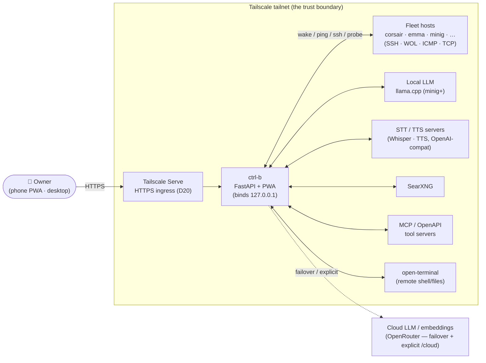
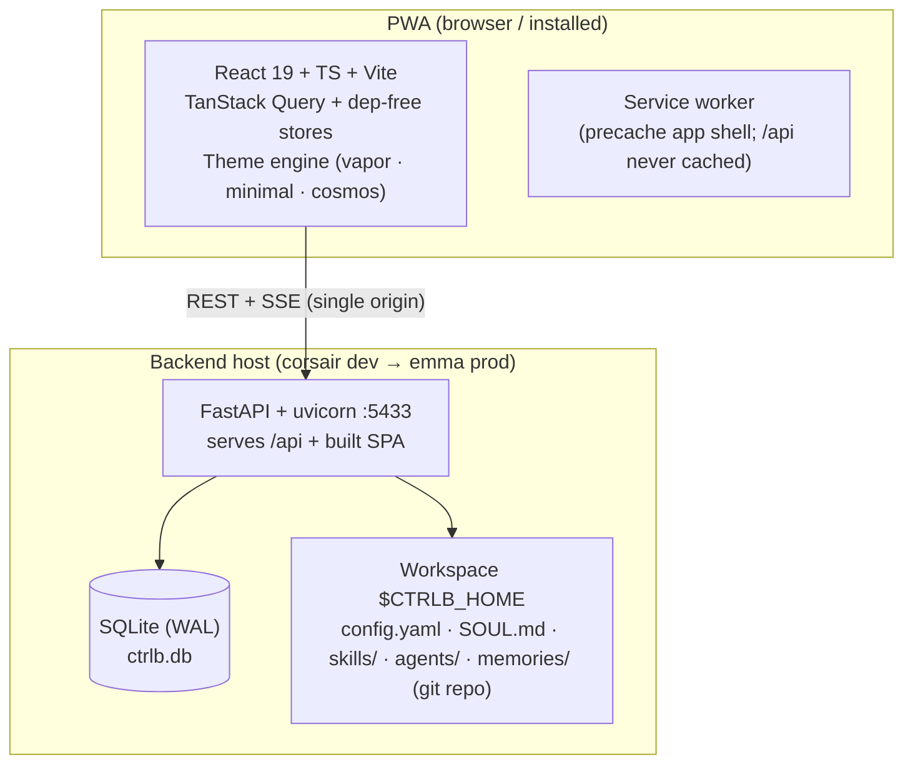
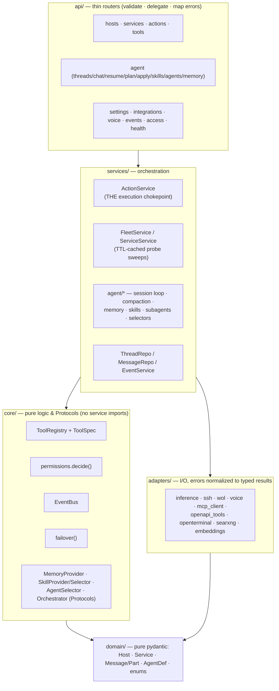
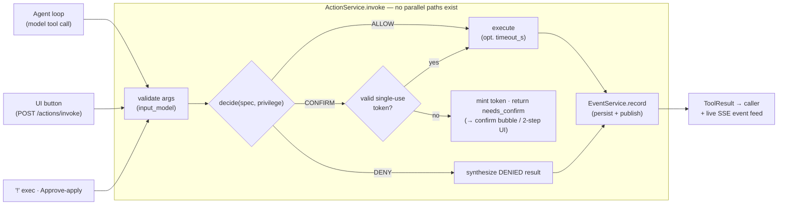
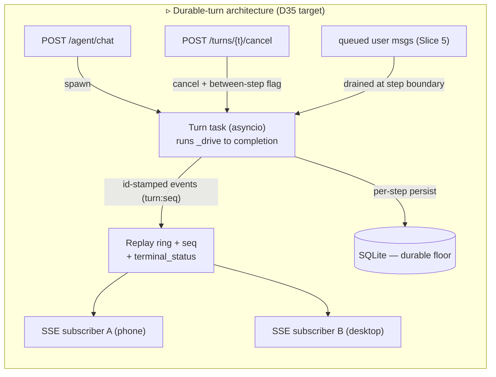
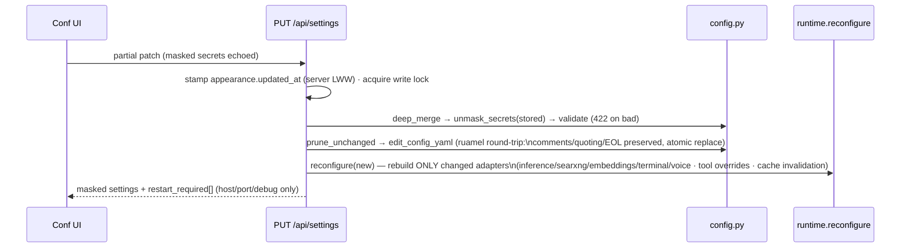
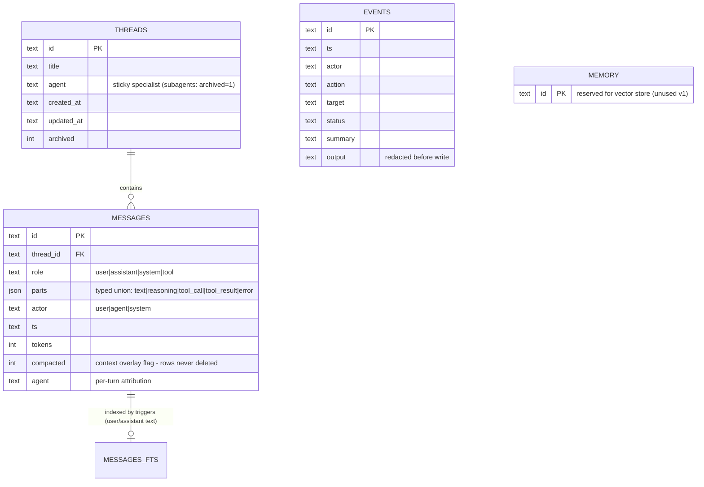

# ctrl-b — System Specification (visual)

> **What this is.** The visual, one-stop specification of ctrl-b's **functionalities, architecture,
> and design patterns** — the whole system and every subsystem — at C4-style altitude with
> diagrams, flows, state machines, and inventories. It complements (never replaces) the prose
> canon: [`ARCHITECTURE.md`](./ARCHITECTURE.md) (system design rationale), [`DESIGN.md`](./DESIGN.md)
> (code-level contracts), [`DECISIONS.md`](./DECISIONS.md) (locked choices), [`SECURITY_MODEL.md`](./SECURITY_MODEL.md),
> [`THEME_ENGINE.md`](./THEME_ENGINE.md), and the audits ([`AGENT_CHAT_AUDIT.md`](./AGENT_CHAT_AUDIT.md) ·
> [`SYSTEM_AUDIT.md`](./SYSTEM_AUDIT.md) · [`UI_AUDIT.md`](./UI_AUDIT.md)). On conflict, DECISIONS wins.
>
> **Status legend** — ✅ built & verified (v1.0, audited 2026-07) · ▹ planned target state (ACA
> plan **approved 2026-07-07** = `TODO.md` Phase 12; its D-entries are drafted per slice — not yet
> built) · ◇ named seam (designed extension point, build-on-demand). Pillar ids are **P#** — **F#**
> is reserved for `UI_AUDIT.md` finding ids.
>
> *Source of truth for this document: direct code audit of the full stack (see the two audit docs'
> method sections). Drawn 2026-07-07.*

---

## 1. Product vision & functionality inventory

**ctrl-b is a single-user, self-hosted homelab control panel**: a mobile-first PWA through which
the owner wakes, monitors, and manages a small fleet of PCs and services over LAN + Tailscale —
by touch, by chat with a tool-using LLM agent, or by voice. It is **tailnet-only by construction**
(no public exposure), runs a **weak local model first** with cloud failover, and treats every
privileged operation as a **typed, gated, audited action**. The aesthetic contract is the Vapor
design (D7) with a multi-theme engine on top (D28/D29/D31).

| # | Pillar | Capabilities | Status |
|---|--------|-------------|--------|
| P1 | **Fleet control** | Wake-on-LAN, ICMP liveness + latency, SSH shutdown/reboot, per-host service start/stop/restart, TCP service probes, open-service-URL, host/service CRUD from the UI | ✅ |
| P2 | **Agent chat** | Streaming tool-loop chat (SSE), the full action registry as OpenAI tools, confirm-gated risky calls with suspend/resume, task plans (TodoWrite-style + clickable panel), clarifying questions, context compaction w/ selectable summarizer, per-message local/cloud switch, markdown replies | ✅ |
| P3 | **Agent platform** | File-discovered **skills** (SKILL.md; user- & selector-invoked, toolset narrowing), folder-discovered **agents** (agent.yaml + SOUL.md persona; `/agent` switch + optional auto-routing), headless **subagents** (bounded parallel, privilege-clamped), **memory** (MEMORY/USER/STATE stores, cap headers, propose-or-auto-write, git-versioned), **session search** (FTS5), loop-discipline guards, self-managed skills (`skill_manage`) | ✅ |
| P4 | **Integrations** | MCP client (streamable-HTTP + stdio), generic OpenAPI tool servers, open-terminal remote shell/files, SearXNG `web_search`, embeddings client (seam), per-tool overrides (description + tri-state agent access), between-turn rediscovery | ✅ |
| P5 | **Voice** | Push-to-talk dictation (STT proxy, 5-state mic), read-aloud TTS (per-bubble + auto-TTS, docked mini-player, blob cache), primary→fallback failover per service, capability-probed UI | ✅ |
| P6 | **Config & ops** | Whole config editable in-app (masked secrets, comment-preserving writes, hot-apply), Tailscale Serve HTTPS toggle, live events feed + audit trail, guarded `!` shell escape hatch (opt-in), PWA install/update | ✅ |
| P7 | **Theming** | Registry-driven multi-theme engine (vapor frozen-bespoke · minimal · cosmos), token-driven Kit scaffold, View-Transition switching, per-theme settings, cross-device appearance sync (LWW) | ✅ |
| P8 | **Durable turns** | Server-owned turn lifecycle: disconnect-proof generation, reconnect replay/snapshot, explicit cancel + Stop button, mid-turn steering queue | ▹ ACA Slices 3/5 (D35) |
| P9 | **Perf & routing** | Parallel read-only tool execution + per-call result streaming, compaction v2 (reserve-headroom, tool-result clearing), lead/worker model routing, persisted approvals | ▹ ACA Slices 4/6/7/8 |
| P10 | **Future** | Automations/schedules, notifications, wake word, idle shutdown, vector memory, privilege ladder UI | ◇ ROADMAP seams |

---

## 2. System context (C4 L1)



**Boundary rules (SECURITY_MODEL):** the backend never binds publicly; Serve is the only HTTPS
ingress; no auth *inside* the tailnet (single-user trust model); secrets live only in gitignored
`config.yaml`/`.env`, masked on read, redacted from free text; the raw-shell paths are **off by
default** and double-gated. ▹ Rider (SYS-4): the *dev* Vite proxy widens this on the LAN — to be
documented as an explicit decision.

## 3. Containers & deploy topology (C4 L2, D32)



| Container | Tech | Responsibility | Talks to |
|---|---|---|---|
| PWA | React 19, TS strict, Vite, vite-plugin-pwa | All presentation; offline shell; voice capture/playback | `/api` REST + 2 SSE feeds |
| API server | FastAPI, uvicorn, sse-starlette | Everything else: registry, gate, agent loop, proxies, config | fleet, LLMs, voice, MCP/OpenAPI, SearXNG |
| SQLite | aiosqlite, WAL, numbered migrations | threads/messages (parts-JSON), events audit, FTS5 index | — |
| Workspace | plain files + a local git repo | config, personas, skills, agents, memory (auto-committed) | — |

**Deploy (D32):** prod = emma, systemd, `:5433`, `CTRLB_HOME=~/.ctrl-b`, Serve → HTTPS
`emma.….ts.net`; isolated dev instance `:5434` + `~/.ctrl-b-dev`; corsair remains the Windows dev
checkout (no `--reload` on Windows — subprocess event-loop gotcha). Bootstrap via
`deploy/bootstrap.py`; runbook `DEPLOY_EMMA.md`.

## 4. Backend architecture (C4 L3)

### 4.1 Layering (ports & adapters)



Composition root = `main.py::lifespan` (builds in dependency order onto `app.state`);
`runtime.py` = the **anti-drift reconstruction seam** (every adapter has exactly one `set_*`
construction site shared by startup and hot-reload).

### 4.2 The execution chokepoint — every capability, one path



**The gate truth table** (`core/permissions.decide` — pure, unit-tested):

| Privilege ↓ / Tool → | LOW risk | MED risk | HIGH risk or `confirm=True` | `run_shell`* |
|---|---|---|---|---|
| `readonly` | ALLOW (non-action cat.) / DENY actions | DENY | DENY | DENY |
| `confirm` (default) | ALLOW | CONFIRM | CONFIRM | DENY* |
| `auto_low` | ALLOW | ALLOW | CONFIRM | DENY* |
| `full` | ALLOW | ALLOW | ALLOW | ALLOW |

\* unless `shell.agent_exec_enabled` opts the agent in (both shell gates default **off**).
▹ Slice 8 adds persisted "always allow" between DENY and CONFIRM (can only downgrade risk-derived
confirms; policy-DENY always wins — precedence ladder specified in ACA).

### 4.3 The tool registry — one capability model

| Provider | Registers | Naming | Risk source |
|---|---|---|---|
| Built-in actions (`@action`) | wake/ping/shutdown/reboot/start/stop/restart/check_service/open_service_url/run_shell/tailscale_* | plain | decorator |
| Cognitive builtins (`core=True`, always reachable) | `task_plan` · `question` · `memory` · `session_search` · `skill_manage` · `spawn_subagents` | plain | decorator |
| Utilities (`@tool`) | `web_search`, misc UI cards | plain | decorator |
| open-terminal | `terminal_exec/read/write/list/grep/glob` | plain | **config per-op** (reads LOW, exec/write HIGH) |
| MCP servers | discovered per server | `mcp__<server>__<tool>` | annotations (readOnly→LOW, destructive→HIGH) else server config |
| OpenAPI servers | one per operation | `api__<server>__<opId>` | GET/HEAD→LOW; mutating→server config |

Per-tool **overrides** (`tool_overrides{name: {description, agent_mode}}`, D22) overlay the live
specs; agent allowlists (`AgentDef.tools`, glob) + skill narrowing intersect it; `core` builtins
survive both. Registry rebuilds only **between** turns (▹ ACA-17 closes the auto-path race).

### 4.4 Design-pattern catalog (named, verified in code)

| Pattern | Where | Note |
|---|---|---|
| Ports & adapters (hexagonal) | whole backend | import-disciplined; Protocols at the seams |
| Composition root + anti-drift construction seam | `main.py` + `runtime.py` | one construction site per adapter |
| Registry | tools · themes · memory stores · proposables | "adding one = one row, never a switch statement" |
| Chokepoint (single writer/path) | ActionService · `edit_config_yaml` · EventService | uniqueness verified by audit |
| Strategy via Protocol (swappable defaults) | Skill/Agent selectors, MemoryProvider/Backup, Orchestrator | D11 |
| Derived state doctrine | fleet/service status, tailscale state, skills/agents/memory | *config declares, probes derive, nothing recomputable stored* |
| Single-flight TTL cache | Fleet/Service sweeps | N clients share one probe |
| Failover primitive (value-agnostic) | `core/failover` → inference (first-chunk probe), voice | degradation surfaced, never silent |
| Structured concurrency | subagents (`asyncio.TaskGroup` + semaphores + clamps) | cancel-parent-cancels-tree |
| Unified per-item config object | `ToolOverride`, host `services{}`, `appearance` blob | owner directive: shape to extend, not migrate |
| Prompt-cache stability layering | agent session static head + tools cache | Codex/Claude-Code doctrine, independently converged |
| Progressive disclosure | skills (instructions only when active), memory caps | context economy for the weak local model |
| External-store binding (dep-free) | `createStore` (D23) ×10 stores | documented snapshot contract |
| Thin host + headless controllers | `App` → ActiveRoot; `useComposer`/`useAgentChat` (D29) | logic themes share, markup themes own |
| Command palette / prefix routing | composer `!` · `/verb` · text | one grammar, all themes |

## 5. Key flows

### 5.1 Agent chat turn — stream · tool loop · confirm suspend/resume ✅ (▹ D35 deltas noted)

```mermaid
sequenceDiagram
    autonumber
    participant U as PWA (store/chat)
    participant A as api/agent
    participant S as AgentSession
    participant I as InferenceClient
    participant X as ActionService

    U->>A: POST /agent/chat {text, thread_id?, mode?, skills?, privilege?}
    A->>A: thread ?: create · rediscover-if-dirty · resolve AgentDef (+auto-route◇)
    A-->>U: SSE: thread {threadId,title}
    A->>S: run_turn()
    S->>S: activate skills · persist user msg · arm reflection?
    loop ≤ max_iterations
        S->>S: compact if over threshold (▹ v2: reserve-headroom + notice)
        S->>I: stream_chat(static head + history, tools)
        Note over I: failover at first chunk only;<br/>degraded → SSE notice
        I-->>U: reasoning.delta* · text.delta* (relayed per token)
        alt no tool calls
            S-->>U: message.end · done(completed)
        else tool calls
            S-->>U: part.added (per call) · message.end
            loop calls in model order (▹ Slice 4: safe prefix in parallel, results streamed per call)
                S->>X: invoke(tool, args, privilege)
                alt CONFIRM needed
                    X-->>S: needs_confirm + token
                    S-->>U: tool.permission {callId, token, risk} · done(suspended)
                    Note over U,S: turn ends; state durable (AWAITING_CONFIRM)
                else executed / denied
                    X-->>S: ToolResult (Event recorded)
                    S-->>U: tool.result (▹ today: batched end-of-step)
                end
            end
            Note over S: loop guards: repeat cap · per-tool cap ·<br/>stall detector → forced tool-less finalize
        end
    end
    U->>A: POST /agent/resume {call_id, execute|dismiss|answer}
    A->>S: resume() — re-mint token (J3) · single-flight (J2) → finish step → loop continues
```

▹ **D35 (Slice 3)** re-homes this generator into a server-owned **TurnRegistry** task with a
monotonic-`seq` replay ring: disconnect detaches a subscriber instead of cancelling the turn;
`GET /agent/turns/{thread}/stream` re-attaches (tail-replay or snapshot); `POST …/cancel` is the
explicit, idempotent stop; ▹ Slice 5 drains a steering queue at each step boundary.



### 5.2 Tool-call lifecycle (RunState) ✅

```mermaid
stateDiagram-v2
    [*] --> pending: model emits call
    pending --> ok: ALLOW → executed
    pending --> denied: policy / headless confirm / unknown tool
    pending --> error: adapter failure (normalized)
    pending --> timeout: spec timeout_s
    pending --> awaiting_confirm: CONFIRM (interactive)
    pending --> awaiting_answer: question tool
    awaiting_confirm --> ok: resume(execute) — re-minted token
    awaiting_confirm --> skipped: resume(dismiss)
    awaiting_answer --> ok: resume(answer) — reply injected as result
    awaiting_answer --> skipped: resume(dismiss)
    note right of awaiting_confirm: durable in SQLite —\nsurvives reload/restart;\nabandoned → synthesized\n"skipped" in next context
```



▹ D35 adds `cancelled` (in-flight calls marked + synthesized like abandoned confirms).

### 5.3 Settings hot-apply ✅



### 5.4 Voice ✅

```mermaid
sequenceDiagram
    participant M as Mic (useDictation)
    participant V as /api/voice/stt
    participant W as Whisper primary→fallback
    M->>M: tap → getUserMedia → MediaRecorder\n(mime negotiated; ext follows actual container)
    M->>V: POST clip (multipart)
    V->>W: transcriptions.create (+vad/hotwords via extra_body)
    Note over V,W: any error → next endpoint (failover);\nX-Voice-Served-By surfaces degradation
    V-->>M: {text} → appendDraft (review) · or auto-send when idle
```

Mic state machine: `idle ↔ recording → sending → idle`, plus reactive `unavailable` (502, re-arms
on next status probe) and `insecure` (no secure context — tappable, explains the HTTPS fix).
TTS: per-bubble ▶/⏸ + auto-TTS on turn completion → `/api/voice/tts` (whole-clip, seekable) →
singleton `<audio>` + blob cache + docked MiniPlayer.

### 5.5 Theme switch ✅

`switchTheme(next)`: **preload first** (CSS + fonts + lazy Root chunk, cached promises) → then
`startViewTransition(() => flushSync(setUI(...)))` — gated on `ui.motion` and feature support;
load failure aborts and stays on the current theme. `preloadableRoot` renders synchronously once
loaded, so the transition snapshot never captures a Suspense fallback.

## 6. Data & persistence

### 6.1 SQLite (WAL · numbered migrations · single write lock)



Doctrine: **message-has-parts** (schema grows via the JSON union, not migrations); **compaction is
an overlay** (`compacted` flag + summary system-message; full history immutable); events =
domain-level audit trail. ▹ SYS-1 adds `Database.transaction()` for multi-statement sequences.

### 6.2 The workspace (`$CTRLB_HOME`, relocatable — D14/D15)

```
$CTRLB_HOME/
├── config.yaml            # THE config (gitignored; UI-managed; comment-preserving writes)
├── ctrlb.db               # SQLite (chat · events · FTS)
├── SOUL.md                # default agent persona (slot #1 of the prompt)
├── skills/<name>/SKILL.md # global skills (frontmatter + instructions)
├── agents/<slug>/         # specialists: agent.yaml (overrides) + SOUL.md + skills/
└── memories/              # ← local git repo (D26, auto-commit + external-edit sweep)
    ├── MEMORY.md USER.md STATE.md      # default agent + global stores (capped, § entries)
    └── agents/<slug>/MEMORY.md STATE.md
```

### 6.3 Config surface (`config.yaml` sections)

| Section | Governs | Hot-apply |
|---|---|---|
| `server` | bind/port/poll cadence/debug | poll live; host/port/debug → restart-flagged |
| `computers{}` (+nested `services{}`) | the fleet: ip/mac/ssh/os/services cmd-per-OS | live (projected per call) |
| `inference` | local/cloud endpoints, default mode, failover chain, prompts | rebuild-on-change |
| `agent` | defaults (AgentDef base), compaction, skills, subagent caps, streaming mode, auto-route | live |
| `memory` | stores, caps, auto-write, nudges, reflection, git backup | live |
| `voice` / `searxng` / `embeddings` / `open_terminal` | endpoints + per-op risk | rebuild-on-change |
| `shell` / `tailscale` | the two guarded escape hatches | live |
| `mcp_servers[]` / `openapi_servers[]` | remote toolsets | between-turn rediscovery |
| `tool_overrides{}` | per-tool description + agent access (D22) | live overlay |
| `appearance` | theme/mode/accent/motion/perf + per-theme settings (server-stamped LWW) | live |

Secrets: two-rule model (declared leaf keys + hinted credential-map subkeys) → masked on GET,
carried-over on PUT, redacted from search snippets, drift-guard-tested.

## 7. Frontend architecture

```mermaid
flowchart TB
    main["main.tsx (QueryClientProvider · SW)"] --> App
    App["App — THIN HOST\n(event stream · viewport · unload guard)"] --> engines["AppEngines (null render)\nuseFleetCycle · useAppearanceSync · useChatInit · useAutoTts"]
    App --> Root["ActiveRoot = registry[theme].Root"]
    Root -->|vapor (frozen bespoke)| VR["VaporRoot: hero canvas · own chrome"]
    Root -->|reskins| DR["Kit DefaultRoot: AppBar · sections · floating Composer · NavBar\n(slots: Fleet override · composer variant/slots)"]

    subgraph state["State"]
        q["TanStack Query: hosts/services/events/settings/…\n(poll-driven server state)"]
        st["createStore singletons ×10:\nchat (streaming reducer) · ui · composer draft ·\nconnection · toast · confirm · dirty · playback · …"]
    end
    DR & VR --> q & st

    subgraph controllers["Headless controllers (D29) — logic without markup"]
        uc["useComposer (draft/send/mic gate)"]
        ua["useAgentChat (messages/plan/results)"]
        us["useSections (theme tab set)"]
    end
    q & st --> controllers --> DR & VR
```

**Render discipline (verified):** token deltas re-render only the streaming bubble (per-message
memo + sliced subscriptions + ref-stable lookups); engines isolated from the theme tree; plan
snapshot content-signature-stable. **Theme contract:** a theme = one `ThemeDef` registry row
(Root, palettes, lazy loadStyles/Fonts/Root, optional per-theme settings auto-rendered in Conf);
reskins = tokens.css over the Kit; vapor = frozen bespoke escape hatch (assimilation ladder
governs graduation, D34). **Wire safety:** every SSE frame validated → drop-not-crash; unknown
events ignored (forward-compatible).

## 8. Wire protocols

### 8.1 Chat SSE vocabulary (DESIGN §12 subset — ✅ built · ▹ additions)

| Event | Payload | Note |
|---|---|---|
| `thread` | threadId, title | head of every turn |
| `message.start` / `message.end` | messageId, agent | per assistant step |
| `reasoning.delta` / `text.delta` | messageId, delta | per token |
| `part.added` | tool_call part | renders command bubble |
| `tool.permission` | callId, tool, args, risk, **token**, prompt | confirm bubble; suspends |
| `tool.question` | callId, question | answer bubble; suspends |
| `tool.result` | callId, ToolResult | resolves bubble (▹ per-call streaming) |
| `compaction` | removed, summaryId, truncated | breadcrumb |
| `notice` | text | failover degradation (D18) |
| `error` | message, retryable | normalized; feeds risk-aware retry (I4) |
| `done` | state: completed·suspended·capped·error | terminal (▹ +cancelled) |
| ▹ `id:` field | `<turnId>:<seq>` | D35 replay cursor |
| ▹ `retry` | attempt, category, delay | Slice 7 wire-visible retries |

Dual-mode delivery (D17): same generator collected into one JSON payload when
`agent.streaming=off`/client asks buffered. Second feed: `GET /api/events/stream` (fleet
activity, EventBus, 15 s keepalive) with client auto-reconnect + reconcile.

### 8.2 REST surface (by router)

| Router | Endpoints (abridged) |
|---|---|
| hosts / services | list + status + CRUD (comment-preserving YAML edits) + wake/shutdown/reboot/start/stop/restart via actions |
| actions / tools | catalog (specs + schemas + retry_safe) · `POST /actions/invoke` (UI two-step confirm) |
| agent | threads CRUD · `chat` · `resume` · `compact` · `plan` · `apply` · `exec` (!) · skills CRUD · agents CRUD (+SOUL, memory stores) · default-prompt |
| settings | `GET/PUT /settings` (masked/hot-apply) · `GET /appearance` |
| integrations | MCP/OpenAPI CRUD · `rediscover` (409 while turn active) · status |
| voice | `status` · `stt` · `tts` |
| events / access / health | audit list + SSE · Tailscale Serve control · health |
| ▹ agent (D35) | `GET /agent/turns/{t}/stream` · `POST /agent/turns/{t}/cancel` |

## 9. Repository structure

```
ctrl-b/
├── backend/
│   ├── app/ {api, services(/actions, /agent), core, adapters, domain, config.py, db.py, main.py, runtime.py}
│   ├── tests/               # 35 files, decision-pinned (test_*_d26 …) + drift guards
│   └── pyproject.toml       # exact pins · ruff (py314) · pyright[nodejs]
├── frontend/
│   ├── src/ {api, components, hooks, lib, store, tabs, theme(-engine)/{kit,…}, themes/{vapor,minimal,cosmos}}
│   ├── tests/ (vitest+jsdom)  e2e/ (Playwright: flows·a11y·render)
│   └── vite.config.ts       # PWA · dev proxy · bundle analyzer
├── docs/                    # the doc system (HANDOFF → DECISIONS → ARCHITECTURE/DESIGN → TODO → …)
├── deploy/ {bootstrap.py, linux/, windows/}   ·   tools/ {check.py, start scripts}
├── skills/ · agents/ · design/ (vapor.html canon) · archive/ (v0.1 + prototypes, reference-only)
└── config.yaml (gitignored) · .githooks/ (pre-commit --fast · pre-push full)
```

## 10. Quality & operations

| Guardrail | Today ✅ | Target ▹ |
|---|---|---|
| One-command gate | `python tools/check.py` — parallel, grouped, run-all-and-summarise (ruff · pyright · pytest ×229 · tsc · eslint · prettier · vitest) | — |
| Hooks | pre-commit `--fast` (instant) · pre-push full (native `core.hooksPath`) | — |
| E2E | `--e2e`: Playwright flows + axe a11y as the **pre-deploy gate** | per-theme render matrix ◇ |
| CI | none | ▹ SYS-14: GitHub Actions `check.py` on ubuntu (first Linux runs pre-emma) |
| Lint/type ratchets | ruff E/F/I · pyright basic · 27 deferred eslint warns | ▹ SYS-16: +ASYNC/B → later strict |
| Coverage | not measured | ▹ SYS-15: measure-only first; Compactor/adapters/parsers pinned |
| Observability | module logs · Events audit trail · failover breadcrumbs | ▹ SYS-11: `server.log_level` knob |
| Backups | memory git repo (auto-commit + sweep) · SQLite file | — |

---

## 11. Roadmap deltas at a glance (what changes this picture)

| Wave | Changes to this spec | Ref |
|---|---|---|
| **Chat hardening** (pre/post-emma) | doc-truth fixes · MCP deadlines · per-thread turn marker (409) · shielded step persistence · SYS-1 transactions · SYS-13 composer fix · CI | ACA 0–2 · SYS |
| **Durable turns** | §5.1 target diagram becomes real: TurnRegistry, replay/snapshot, cancel + Stop, `id:` cursors | ACA 3 (D35) |
| **Interaction speed & steering** | parallel safe calls, per-call results, steering queue (§8.1 additions) | ACA 4–5 |
| **Compaction v2 · routing · approvals** | reserve-headroom trigger (+`context_window` config), assembly-time tool-result clearing, lead/worker ModelRef routing, persisted approvals row in §4.2 | ACA 6–8 |
| **Platform futures** | automations/notifications/wake-word/vector memory slot into existing seams (EventBus, MemoryProvider, registry) | ROADMAP |

*End of specification. Maintain by editing the affected section when a D-entry lands; the ✅/▹/◇
markers are the drift guard — a ▹ that ships flips to ✅ in the same PR.*
